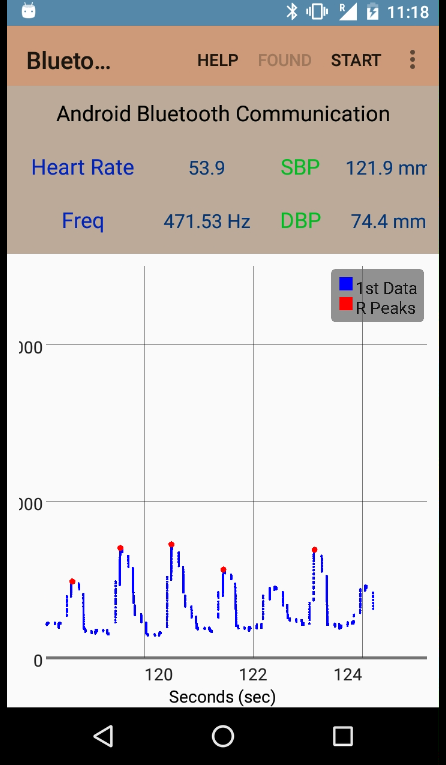
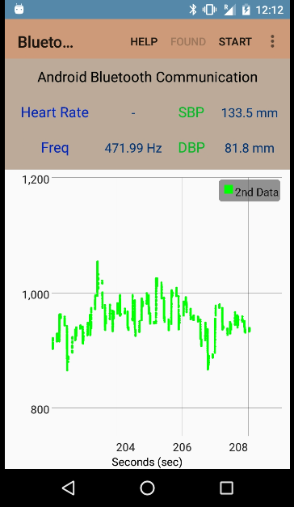
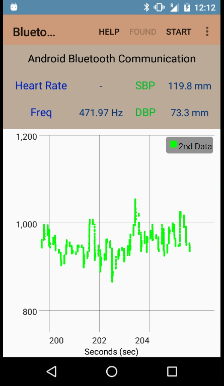

# HR_BP_BLE_Android_Project
Heart Rate &amp; Blood Pressure Monitoring System
## ABSTRACT

The fields of Medical Sciences & Computer Sciences & Electronics are as intermingled as possible in current day scenario, but the real challenge is integrating the technology into devices so as to make them easily usable and understandable by as large a populace as possible. This project aims at the development of an Android Application that is easy to handle and is usable by anyone with basic knowledge of Android Usage and thus provides a sophisticated method to get crucial data including heart rate & Blood Pressure even for common people.

The tools/instruments used for the development of the project are listed below:-
- CC2650EMK-7ID
- SmartRF06 Evaluation Board
- Android Device

### Snapshots

    

